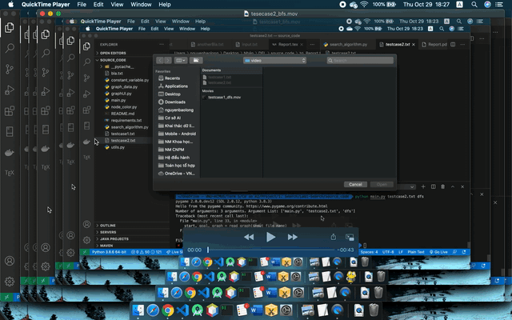
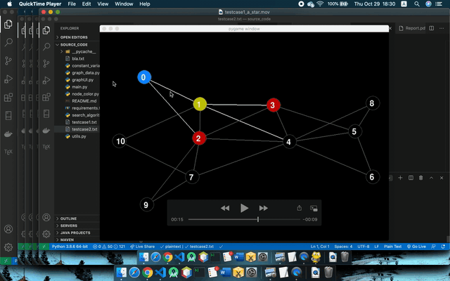

# SearchOnGraph

## Clone về máy và build

Yêu cầu hệ thống  

- Cần cài các thư viện (up lên con python mới nhất và cài các thư viện ở bản mới nhất để không gặp phải những lỗi vớ vẩn)  
    - `pygame`  

    - `networks`  

    - `matplotlib`  

- Chạy lệnh: `python main.py path algorithm`. Trong đó, `algorithm` là tên thuật toán dùng để search. `path` là đường dẫn đến file chứa đồ thị để search (thường là `../Testcase/testcase1.txt`)  

- Các thuật toán dùng để search có thể xem tại file `graphUI.py`. Khi implement thêm thuật toán mới, phải add vào file `graphUI.py` để có thể chạy được tham số dòng lệnh  

## Các thuật toán được cài đặt (chi tiết xem tại file [Report.pdf](https://github.com/baolongnguyenmac/SearchOnGraph/blob/main/Report/Report.pdf))  
- DFS  
- BFS  
- Dijkstra  
- UCS  
- Greedy  
- HillClamping  
- A*  

## Demo sương sương A* và UCS

- Demo UCS  
  

- Demo A*  
